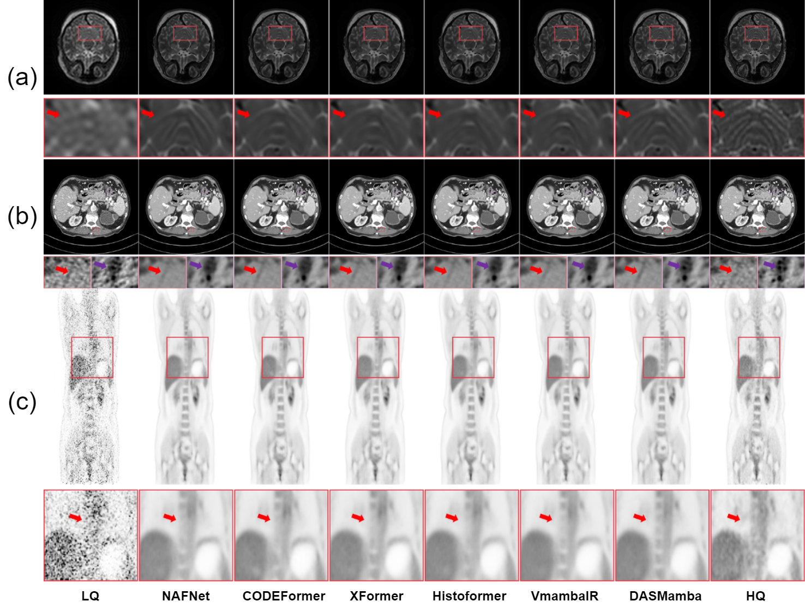

# Directional Adaptive Shuffle-Based Visual State-Space Models for Medical Image Restoration (MICCAI 2025 Oral)
**Note:** This repository is under active preparation. Full code and introduction will be uploaded by the end of next week.

> **Abstract:**  
> Medical image restoration (MedIR) demands precise modeling of anisotropic spatial dependencies, where directional anatomical patterns are frequently degraded by conventional methods. We propose Directional Adaptive Shuffle Mamba (DASMamba), a state-space model architecture that addresses this challenge through two novel components: (1) the Directional Adaptive Shuffle Module (DASM), which captures long-range dependencies via directional adaptive random shuffle and selective scanning, and (2) the Dual-path Feedforward Network (DPFN), enhancing feature representation through multi-scale learning and dynamic channel fusion. By integrating these modules into a hierarchical U-shaped architecture, DASMamba achieves state-of-the-art performance on MRI super-resolution, CT denoising, and PET synthesis tasks while maintaining linear computational complexity. Our framework’s ability to preserve diagnostically critical structural details underscores its clinical value.

## Training

## Testing


## Pre-trained Models
| Dataset   | CT | MRI | PET | 
|-----------|----------|----------|----------|
| Google Drive | [Download](https://drive.google.com/file/d/1ea2yA3HEgXqvthn0knLQMlSpWY896wwW/view?usp=sharing) | [Download](https://drive.google.com/file/d/1WgZzXdqDhdBDIUplgAWwIK-QrtP8KYMx/view?usp=sharing) | [Download](https://drive.google.com/file/d/15g8LgMHcPnqgqWwvAU-noKdpg_vjq5dj/view?usp=sharing) |

## Downloadable Results
| Dataset   | CT | MRI | PET | 
|-----------|----------|----------|----------|
| Google Drive | [Download](https://drive.google.com/drive/folders/1FrSTGAimJf08aV_kEL5GJPhru88NtO5Z?usp=sharing) | [Download](https://drive.google.com/drive/folders/1uj2iftqrVbWOiB8Z8H_rTA7DTR1sxHmL?usp=sharing) | [Download](https://drive.google.com/drive/folders/1SBej70dgUva8HljmmezULX3ZgJ95ekAY?usp=sharing) |

## Visual results
<p align="center">
  
  <br>
</p>

## Acknowledgment  
This repository builds upon the code and dataset provided by the authors of [Restore-RWKV](https://github.com/Yaziwel/Restore-RWKV).  
We thank them for making their work publicly available. Thanks to the authors for their excellent work.

## Citation
If you use this repository or ideas from our work in your research, please consider cite both our paper and Restore-RWKV:

```bibtex
@misc{yang2024restorerwkv,
  title={Restore-RWKV: Efficient and Effective Medical Image Restoration with RWKV},
  author={Zhiwen Yang and Jiayin Li and Hui Zhang and Dan Zhao and Bingzheng Wei and Yan Xu},
  year={2024},
  eprint={2407.11087},
  archivePrefix={arXiv},
  primaryClass={eess.IV}
}

@InProceedings{ChaSim_Directional_MICCAI2025,
        author = { Chan, Simon C. K. AND Shi, Lulin AND Huang, Bingxin AND Wong, Terence T. W.},
        title = { { Directional Adaptive Shuffle-Based Visual State-Space Models for Medical Image Restoration } },
        booktitle = {proceedings of Medical Image Computing and Computer Assisted Intervention -- MICCAI 2025},
        year = {2025},
        publisher = {Springer Nature Switzerland},
        volume = {LNCS 15972},
        month = {September},
        page = {160 -- 170}
}
